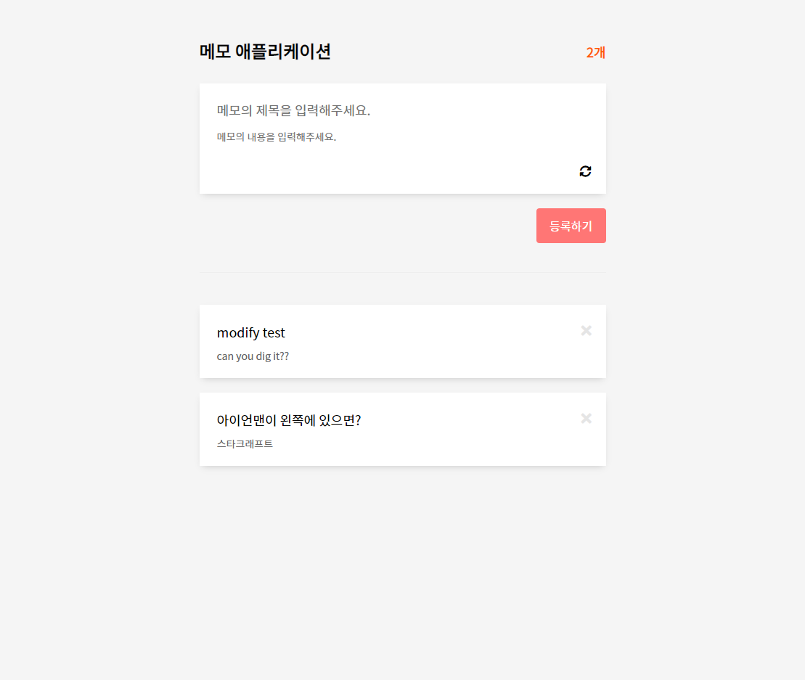
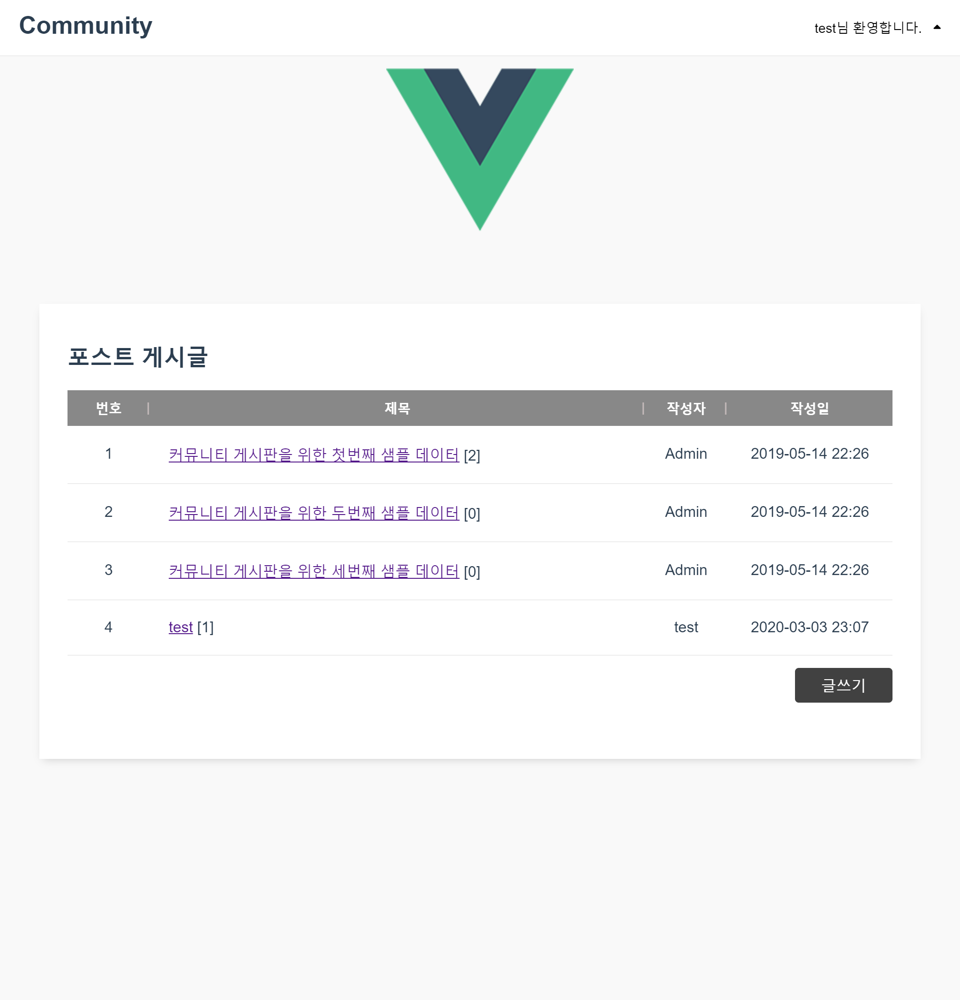
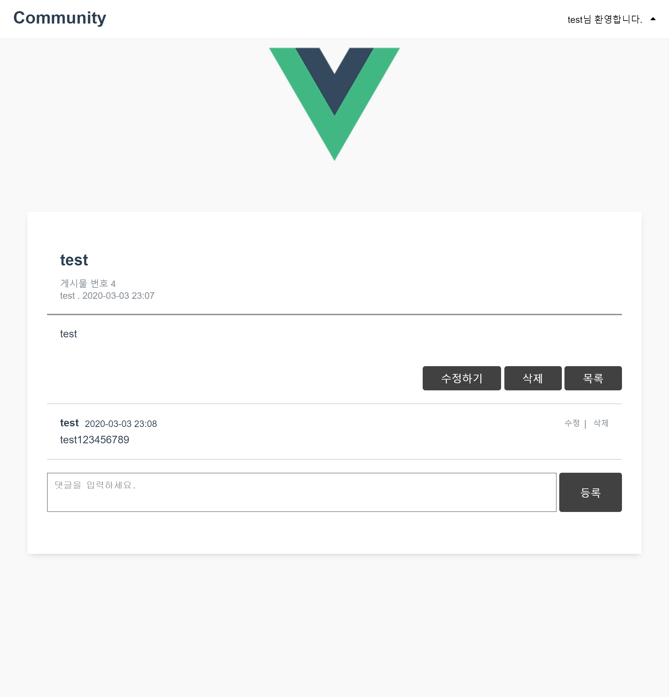
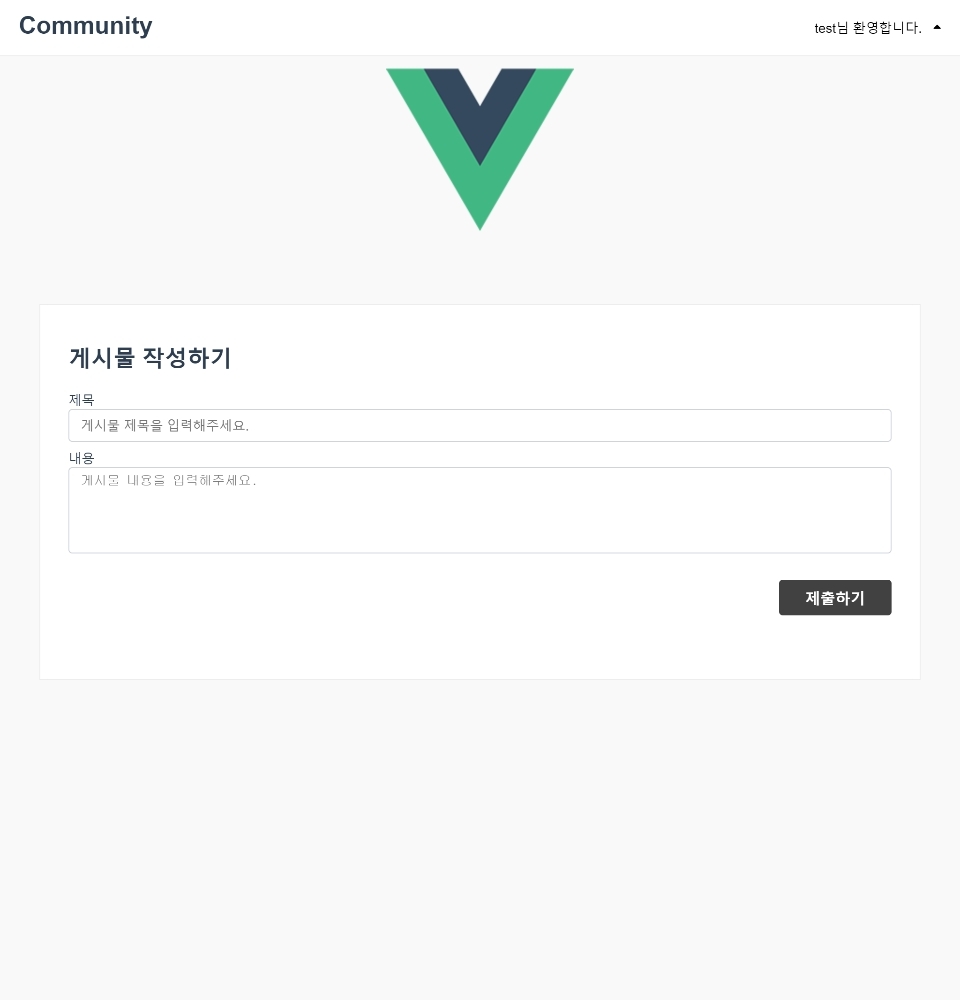
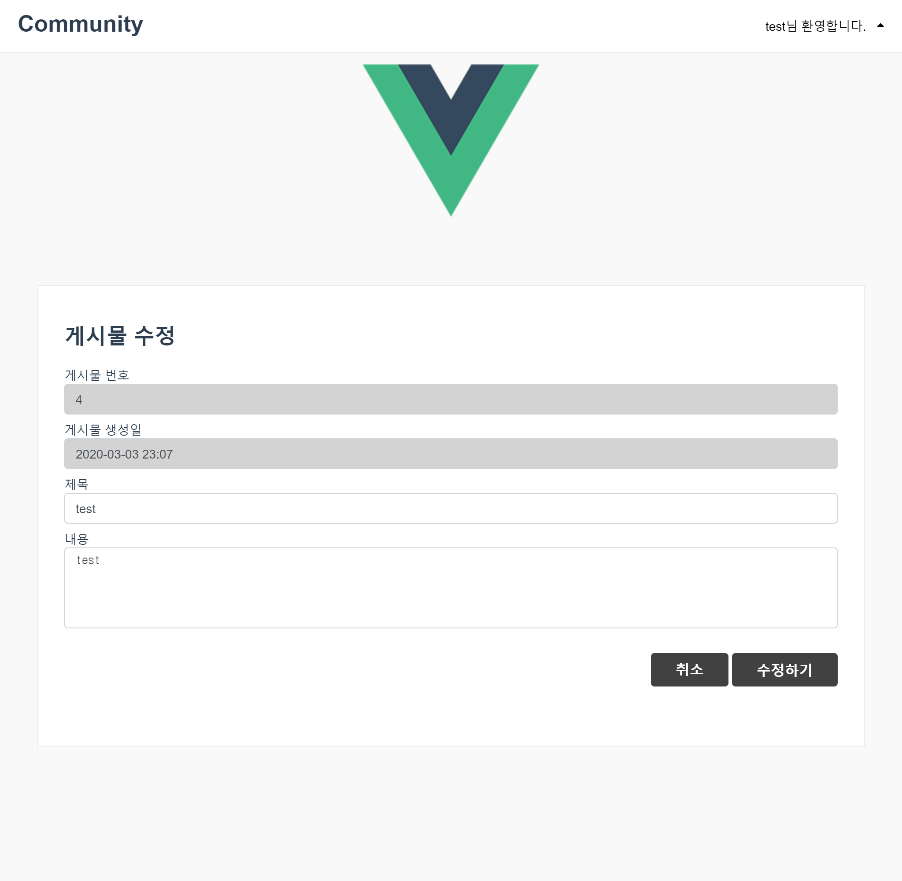
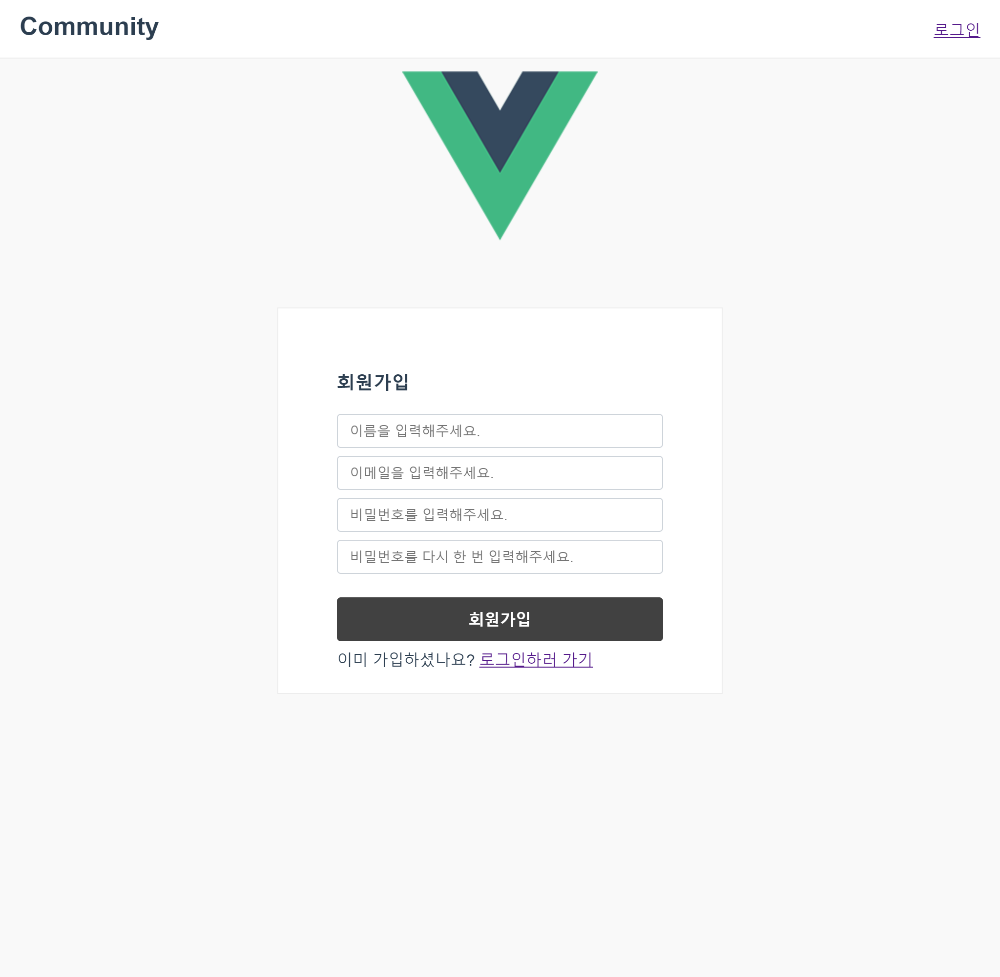
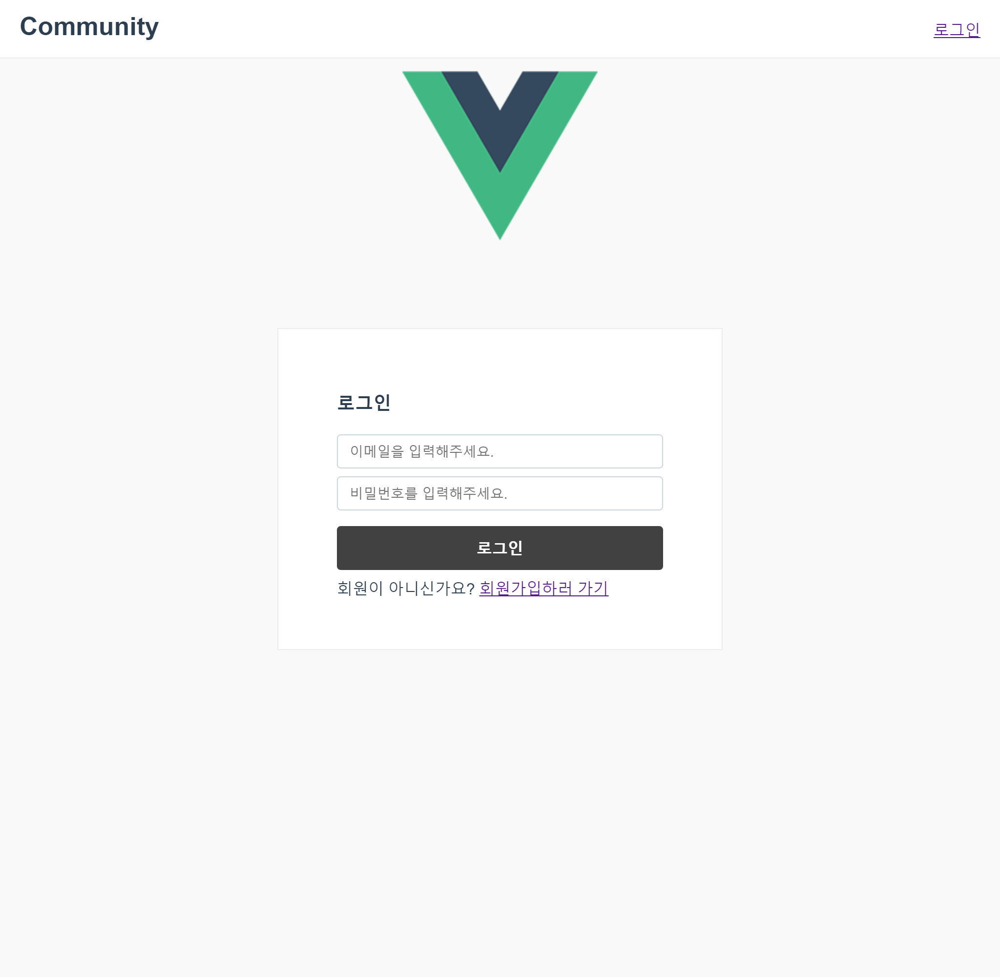

# Vue-with-Coffee

☕커피 한 잔 마시며 끝내는 Vuejs✔

> - nodejs의 구버전을 사용중입니다.
> - Vuejs의 2.x 구버전을 사용중입니다.

# ✏[메모 관리 애플리케이션](https://github.com/CaesiumY/Vue-with-Coffee/tree/master/memoApp)

## 📷스크린샷

스크린 샷

</img>

## ⌨기능

- 메모 생성(**C**reate)
- 메모 읽기(**R**ead)
- 메모 수정(**U**pdate)
- 메모 삭제(**D**elete)
- Vuex를 통해 메모 개수 카운트
- Axios로 백엔드 REST api와 연결

# 📫[커뮤니티 애플리케이션](https://github.com/CaesiumY/Vue-with-Coffee/tree/master/boardApp)

## 📷스크린샷

포스트 리스트 페이지

</img>

포스트 뷰 페이지

</img>

포스트 생성 페이지

</img>

포스트 수정 페이지

</img>

회원 가입 페이지

</img>

로그인 페이지

</img>

## 🎹기능

- 게시글, 댓글 생성
- 게시글, 댓글 읽기
- 게시글, 댓글 수정
- 게시글, 댓글 삭제
- 회원 가입
- 로그인
- 사용자 인증 네비게이션 가드
- 쿠키를 이용한 자동 로그인
- Vuex & Vue Router 사용
- Axios로 백엔드 연결
